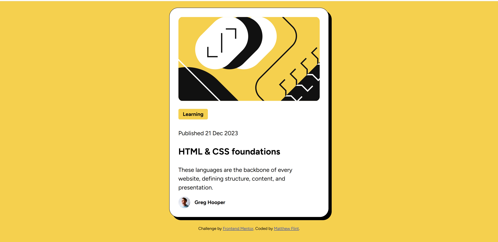

# Frontend Mentor - Blog preview card solution

This is a solution to the [Blog preview card challenge on Frontend Mentor](https://www.frontendmentor.io/challenges/blog-preview-card-ckPaj01IcS). Frontend Mentor challenges help you improve your coding skills by building realistic projects. 

## Table of contents

- [Overview](#overview)
  - [The challenge](#the-challenge)
  - [Screenshot](#screenshot)
  - [Links](#links)
- [My process](#my-process)
  - [Built with](#built-with)
  - [What I learned](#what-i-learned)
  - [Continued development](#continued-development)
- [Author](#author)

## Overview

General wrap-up of the process building this Blog Preview Card, including lessons learned and areas of improvement, with screenshot of the final product and links to my GitHub and Frontend Monitor profiles.

### The challenge

Users should be able to:

- See hover and focus states for all interactive elements on the page

### Screenshot



### Links

- Solution URL: [Add solution URL here](https://github.com/Matthew-Flint/Blog-Preview-Card)
- Live Site URL: [Add live site URL here](https://matthew-flint.github.io/Blog-Preview-Card)

## My process

### Built with

- Semantic HTML5 markup
- CSS custom properties
- Flexbox

### What I learned

For this one, I tried to more closely follow the design laid out in Figma. It was quite a challenge getting all of the padding and gaps to align - I think I was relatively successful, but there are still some areas I'd like to prove. I'm happy that I managed to figure out how to properly center the image vertically as well as horizontally, which I struggled to do with my last project. Here's the snippet I'm proud of: 

```css
body {
    background-color: #F4D04E;
    font-family: 'Figtree', sans-serif;
    display: flex;
    flex-direction: column;
    justify-content: center;
    align-items: center;
    gap: 24px;
    min-height: 100vh;
}
```
I was able to use a flexbox to center the items, and realised I needed to make the height of the container 100% of the viewport so that centering the item would actually center it properly rather than only take up the height of the content. 


### Continued development

I want to improve my understanding of padding and gaps as well as better interpreting the Figma designs - I'm still not entirely across how some of the content creates extra margins that I didn't dictate myself in the code. 

## Author

- Website - [Matthew Flint](https://github.com/Matthew-Flint)
- Frontend Mentor - [@Matthew-Flint](https://www.frontendmentor.io/profile/Matthew-Flint)
